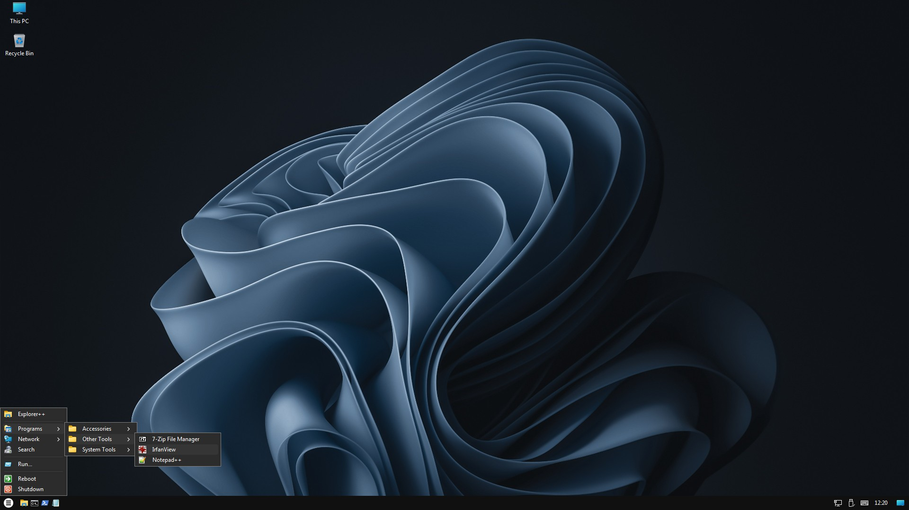

# TinyWin11 - a Windows 11 based live USB and VM under 700 MB

TinyWin11 a tiny live USB (as well as VM) based on Windows 11 PE and a slightly adjusted version of custom desktop shell called [WinSetupShell](https://github.com/59de44955ebd/WinSetupShell). It's actually just a by-product of this other project.

TinyWin11 uses the `boot.wim` of the [Win11_23H2_English_x64v2](https://archive.org/details/Win11_23H2_English_x64v2) setup .iso, with `setup.exe` (inside `boot.wim`) replaced by this custom shell, so it directly boots into a desktop session instead of the original Windows 11 setup window. Release 23H2 was used to maximize hardware compatibility (no SSE4.2 requirement), but the same thing could of course also be done with later Windows 11 setup releases like 24H2 and 25H2. Other Windows 11 hardware requirements (like 4+ GB RAM, Secure Boot and TPM 2.0) don't apply anyway, 1 GB RAM and a 20 years old PC should work fine. The only requirement is EFI/UEFI.

TinyWin11 is provided in two flavors:

- as virtual machine for [VMware Workstation](https://www.vmware.com/products/desktop-hypervisor/workstation-and-fusion) (Windows, Linux) and [VMware Fusion](https://www.vmware.com/products/desktop-hypervisor/workstation-and-fusion) (macOS).  
  Both are now free (as in beer, not open source).

- as raw disk image (.img) that can be used to create a bootable USB drive using tools like [dd](https://en.wikipedia.org/wiki/Dd_(Unix)), [Etcher](https://etcher.balena.io/) or [Rufus](https://rufus.ie/en/).

Check out WinSetupShell's [README.md](https://github.com/59de44955ebd/WinSetupShell/blob/main/README.md) for
more infos about the shell, like its features and restrictions, how to configure it, how to add additional programs etc.

## How the disk images were created

Steps to create `TinyWin11_23H2_English.img` in Windows:

1. Create a 8 GB raw disk image file called `TinyWin11_23H2_English.img` e.g. with `dd` (provided).

2. Use `VhdTool` (provided) to append a .vhd footer (just a few extra bytes) to the image file, rename it to `TinyWin11_23H2_English.img.vhd` and mount it in the system (using Explorer or DiskPart).

3. Start [Rufus](https://rufus.ie/en/) and let it "burn" a Windows setup .iso onto this mounted image. Use "GPT" as partition scheme, "UEFI (non CSM)" as target system, "NTFS" as file system and (optional) "TinyWin11" as volume label.

4. When `Rufus` is done, navigate to the new Windows setup volume and in folder `sources` delete everything except for `boot.wim`. You can also delete file `setup.exe` and folder `support` in the root directory.

5. Open this remaining `boot.wim` with [7-Zip](https://7-zip.org/), and inside the .wim file in folder "2" replace the original `setup.exe` with the provided `setup.exe` that starts the shell. Also copy folder `shell_data` into folder "2". Then close `7-Zip`.

6. Copy `autorun.inf`, `TinyWin11.ico` and the two folders `programs` and `userprofile` to the root of the mounted volume.

7. Use Sysinternals' `Sdelete` (provided) to zero the free space (almost 7.3 GB)
of this volume. This optional step allows to zip/7z-compress the final image file much more efficiently.

8. Unmount `TinyWin11_23H2_English.img.vhd`, again either with Explorer or DiskPart.

9. Remove the last 512 bytes (the VHD footer) e.g. with `truncate` (provided) and rename the file back to `TinyWin11_23H2_English.img`.

10. Done.

`qemu-img` can be used to convert this `.img` disk image file to a `.vmdk` disk image file for VMware.
